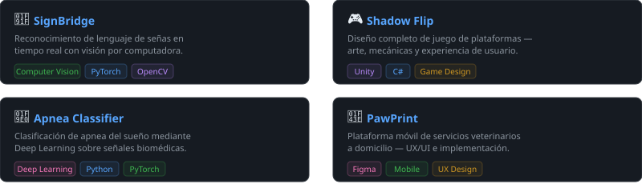

<div align="center">

<h1> Hola, soy Vanessa</h1>

[](https://git.io/typing-svg)

<br/>

[](https://gisselquitian.vercel.app/)
[](https://www.linkedin.com/in/gissel-vanessa-quitián-rojas-62b488362)
[](mailto:gisselV.quitian@gmail.com)

</div>

---

## Sobre mí

```text
Nombre     →  Gissel Vanessa Quitián Rojas
Ubicación  →  Colombia 🇨🇴
Estudios   →  Ingeniería en Sistemas + Ingeniería Multimedia
Enfoque    →  Frontend · Game Dev · 3D · Deep Learning · LLMs
Filosofía  →  Código con la sensibilidad visual del diseño multimedia
```

> Construyo soluciones en la intersección del **código** y el **diseño visual**.

---

## Stack tecnológico

**IA & Datos**


**Frontend & Backend**


**Bases de datos & DevOps**


**Diseño & Multimedia**


---

## Proyectos destacados

<div align="center">



</div>

## Estadísticas

<div align="center">


<br/>


</div>

---

## 🐍 Contribuciones

<div align="center">


</div>

---

<div align="center">

**Gracias por visitar mi perfil** ✨

*Construyendo en la intersección del código y el diseño · Colombia 🇨🇴*

</div>
